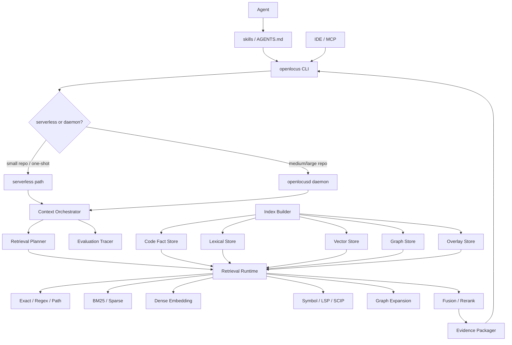

# OpenLocus 研究型设计文档

> 版本：v0.2 convergence draft  
> 日期：2026-06-11  
> 定位：面向 coding agents 的代码事实检索内核与上下文编排系统  
> 设计取向：前期研究优先，允许激进探索；核心契约保持保守、可验证、可替换

本阶段目标不是过早收敛到最终产品形态，而是快速验证哪些 retrieval、graph、remote model、agentic context、trajectory reuse 技术真实提升 coding agent 的上下文质量。除 **Evidence contract、policy boundary、trace/eval** 外，其他模块都应默认可替换、可失败、可关闭、可丢弃。

---

## 0. 一句话定位

**OpenLocus 不是“代码向量库”，而是一个面向 agent 的、local-first but not local-only 的代码事实检索内核。**

它的目标不是把更多代码塞进上下文，而是在变化中的本地仓库里，为 coding agent 快速返回可验证、可审计、带来源的代码证据：

```text
Core: path + line range + content_sha + why + score + channels
Meta: symbol + tree_sha + freshness + policy when available
```

其中：

- **local-first** 是信任基线：源码控制面、索引元数据、热路径检索、权限策略默认本地优先。
- **not local-only** 是工程现实：dense embedding / reranker / LLM planner 可以把 policy-approved remote inference 作为正常实现路径，因为用户本地不一定有 GPU、模型 runtime 或统一推理环境。
- **evidence-first** 是核心契约：任何智能层都必须落回源码证据；不允许不可追溯的代码事实。
- **precision-biased** 是检索哲学：对 coding agent 来说，错误 top result 往往比漏掉一个结果更危险。

---

## 1. 背景与公开系统观察

本节引用的外部数字与产品结论均应理解为“公开资料 / 特定 benchmark 中的声称或观察”，不能直接作为 OpenLocus 的目标基线。OpenLocus 必须在自己的 eval harness 中复现或证伪这些结论。

### 1.1 行业趋势

当前公开的代码检索与 agent context 系统已经从“单一向量检索”转向以下组合：

1. **Hybrid retrieval**：grep / BM25 / dense embedding / symbol / AST / graph 多路召回，再 fusion 与 rerank。
2. **Agentic retrieval**：专用检索子代理并行调用 grep、glob、read、symbol 等工具，而不是让主 agent 在同一个上下文里慢慢搜索。
3. **Context isolation**：大量探索发生在独立上下文窗口，只把证据化摘要返回给主 agent，避免上下文污染。
4. **Incremental indexing**：文件变更、branch 切换、未提交 diff、未保存 buffer 都需要被快速反映。
5. **Process-level evaluation**：不只看 patch pass rate，而是评估 agent 检索了哪些文件、哪些行、是否污染上下文、token 浪费多少。
6. **Privacy-aware remote intelligence**：远端 embedding 可以有价值，但必须有 provider policy、出站审计、secret gating、no-snippet / metadata-only 模式。

### 1.2 一手资料要点

#### Cursor

相关公开资料：

- Cursor Agent Search docs: <https://cursor.com/docs/agent/tools/search>
- Cursor Codebase Indexing: <https://docs.cursor.sh/context/codebase-indexing>
- Cursor Secure Codebase Indexing: <https://cursor.com/blog/secure-codebase-indexing>
- Cursor Fast Regex Search: <https://cursor.com/blog/fast-regex-search>
- Cursor Learn: <https://cursor.com/learn/understanding-your-codebase>

关键启发：

- semantic search + grep 的组合优于单一路线；公开文档称代码问答准确率相对 grep alone 提升约 12.5%。
- Agent 会把 semantic search、grep、file read 串起来，而不是让用户选择具体工具。
- Explore subagent 在独立上下文里执行大量并行搜索，只把发现返回主会话。
- 大仓库上纯 `rg` 可能出现 15s 级延迟，因此本地 regex index / n-gram prefilter 很重要。
- Merkle tree + simhash 可用于增量同步、索引复用和权限证明。
- Cursor 对源码明文存储、路径加密、chunk 解密等隐私边界有明确叙事。

#### Cognition / Windsurf / Devin

相关公开资料：

- SWE-grep blog: <https://cognition.ai/blog/swe-grep>
- Windsurf Fast Context: <https://docs.windsurf.com/context-awareness/fast-context>
- Windsurf Remote Indexing: <https://docs.windsurf.com/context-awareness/remote-indexing>
- DeepWiki MCP: <https://docs.devin.ai/work-with-devin/deepwiki-mcp>

关键启发：

- SWE-grep 把代码检索作为专门任务训练，而不是让通用 frontier model 搜索。
- 每轮最多 8 个并行工具调用，最多 4 轮：3 轮探索 + 1 轮回答。
- 工具集受限为 grep、glob、read 等，保证跨平台与安全。
- reward 以 file retrieval 与 line retrieval 的加权 F1 为核心，并偏向 precision；公开文档提到 F-β 中 β=0.5 的设计取向。
- Fast Context 的价值不只是快，而是避免主 agent context pollution。
- remote indexing 可以采用单租户、embedding 后删除 raw snippets、Store Snippets 关闭等安全策略。

#### Sourcegraph / Cody / SCIP

相关公开资料：

- Cody Context: <https://sourcegraph.com/docs/cody/core-concepts/context>
- Agentic Context Fetching: <https://sourcegraph.com/docs/cody/capabilities/agentic-context-fetching>
- Code Graph: <https://sourcegraph.com/docs/cody/core-concepts/code-graph>
- SCIP: <https://scip-code.org/>
- SCIP GitHub: <https://github.com/sourcegraph/scip>

关键启发：

- 企业场景中，Sourcegraph 明确强调 search-first、code graph、安全、权限、可维护性。
- Cody context 来源包括 keyword search、Sourcegraph search API、code graph、remote repositories、context picker。
- Agentic context fetching 是 mini-agent，用工具检索和反思上下文，再交给最终模型。
- SCIP 是语言无关的 code intelligence index protocol，可表示 definitions、references、symbols、doc comments。
- OpenLocus 应该兼容 SCIP 思路，而不是只依赖 Tree-sitter syntax tags。

#### ContextBench / SWE-ContextBench

相关公开资料：

- ContextBench: <https://contextbench.github.io/>
- ContextBench paper: <https://arxiv.org/pdf/2602.05892>
- SWE-ContextBench: <https://arxiv.org/abs/2602.08316>
- SWEContextBench GitHub: <https://github.com/jiayuanz3/SWEContextBench>

关键启发：

- ContextBench 是 process-oriented evaluation，评估 coding agents 在 issue resolution 中如何检索上下文。
- 数据包含 1,136 issue-resolution tasks、66 repositories、8 languages、human-annotated gold contexts。
- 指标覆盖 file / block / line 粒度的 recall、precision、efficiency。
- 研究发现：LLM 倾向 recall over precision；explored context 与 utilized context 之间有明显 gap。
- SWE-ContextBench 关注跨任务 context reuse，结论是：准确总结和准确检索过去经验能提升 resolution accuracy 并降低 runtime/token cost，但错误 context 会误导 agent。

#### Tree-sitter / LSP / LanceDB / Tantivy / TriviumDB

相关公开资料：

- Tree-sitter: <https://tree-sitter.github.io/tree-sitter/>
- Tree-sitter queries: <https://tree-sitter.github.io/tree-sitter/using-parsers/queries/1-syntax.html>
- LSP 3.17: <https://microsoft.github.io/language-server-protocol/specifications/lsp/3.17/specification/>
- LanceDB hybrid search: <https://docs.lancedb.com/search/hybrid-search>
- LanceDB RRF: <https://docs.lancedb.com/reranking/rrf>
- Tantivy: <https://docs.rs/crate/tantivy/latest>
- TriviumDB: <https://docs.rs/triviumdb/latest/triviumdb/>

关键启发：

- Tree-sitter 适合广覆盖、增量 parse、AST chunk、tags、changed ranges，但不是完整语义。
- LSP 适合实时编辑态语义、未保存 buffer、diagnostics、definition/reference/call hierarchy。
- SCIP 适合 commit-level / CI / persisted precise code graph。
- Tantivy 是 Rust-native BM25 / inverted index 强候选。
- LanceDB 支持 vector + full-text + hybrid + RRF，可作为研究原型。
- TriviumDB 的 vector + graph + document + sparse text 统一思想贴近 OpenLocus，但成熟度需要自证，不宜过早锁死核心路径。

---

## 2. 设计哲学

### 2.1 不是向量数据库

OpenLocus 不应被市场或工程心智定义成“给代码做 embedding 的向量库”。更准确的定义是：

> OpenLocus is a policy-aware code fact retrieval kernel for coding agents. Core evidence retrieval and validation degrade without remote services; semantic model quality may normally rely on policy-approved remote inference.

向量只是一个召回通道，不是产品本体。

### 2.2 Wrong context is harmful

对 coding agent 来说，上下文不是越多越好。错误上下文会导致修改错误文件、误判调用关系、编造 API 行为、忽略 dirty diff、引入回归。因此默认优化目标应是：

```text
Span F0.5 / Precision@K / Citation Validity / Freshness Correctness
```

而不是单纯 Recall@K。

### 2.3 Local-first but not local-only

OpenLocus 的本地优先不是“所有模型必须本地跑”。更精确的原则：

| 能力 | 默认策略 | 可选增强 |
|---|---|---|
| file discovery / path search | 本地 | 无需远端 |
| regex / exact / identifier | 本地 | 本地 n-gram index 加速 |
| BM25 / sparse text | 本地 | 可远端企业 search backend |
| Tree-sitter chunks | 本地 | 无需远端 |
| LSP live overlay | 本地 | 无需远端 |
| SCIP persisted graph | 本地或 CI artifact | 企业 index server |
| dense embedding | 可本地，也可远端 | provider policy 控制 |
| reranker / planner | 可本地规则，也可远端 LLM | top-N、脱敏、审计 |
| index metadata | 默认本地 | enterprise single-tenant 可选 |

结论：

> Local-first is the trust baseline. Core evidence retrieval must degrade without remote services; dense embedding, reranking, and planning may normally use policy-approved remote inference.

### 2.4 Dirty overlay 是一等现实

传统代码搜索面向静态仓库；coding agent 面向变化中的工作区。Agent 需要检索 committed code、working tree dirty files、staged/unstaged changes、unsaved editor buffers、branch switch 后的新旧状态。因此 OpenLocus 必须把 overlay 做成核心层，而不是在主索引旁边打补丁。

### 2.5 No uncited code facts

OpenLocus 可以生成 summary、module map、architecture hints、historical lessons，但它们都必须是 cited views。

```text
No uncited facts.
No stale evidence.
No provider without policy.
No summary without source spans.
```

### 2.6 LLM-derived facts are not authoritative

OpenLocus 可以探索 **LLM indexing**：后台用 LLM 为代码 chunk / symbol / module 生成摘要、标签、自然语言别名、候选 graph edges 或 bug symptom hints。这个方向可能牺牲 index time 与成本，但可能提升自然语言检索、architecture Q&A、bug localization、test selection 的准确性。

但 LLM indexing 的输出只能是 **Derived Index Views**，不是权威代码事实：

```text
LLM-derived view -> helps find candidate spans
EvidenceCore -> still validated against current source
```

约束：

- LLM 生成内容不能进入 EvidenceCore。
- LLM 生成内容不能替代 Tree-sitter / LSP / SCIP / lexical evidence。
- 每个 derived view 必须携带 source spans、source `content_sha`、model_id、prompt_version、policy_mode、freshness state。
- 没有 citation 的 LLM 输出只能作为 query hint，不能进入 evidence pack。
- LLM indexing 可以后台慢慢跑，但不能阻塞 `read/search/symbol` 和 core-only mode。
- 远端 LLM indexing 必须走 provider policy、data levels、secret gate、outbound audit。

一句话：

> LLM indexing may improve candidate discovery, but final answers must bottom out in EvidenceCore validated against current source.

### 2.7 P0 SLO：研究也必须有可用性硬约束

OpenLocus 前期可以激进探索，但检索内核必须被 SLO 约束。没有 SLO，研究会变成“功能很多但不知道什么叫可用”。P0 SLO 继承原研究报告的取向：秒级可用、热路径本地、固定 token 预算下偏 precision。

| 场景 | P0 目标 | 说明 |
|---|---:|---|
| `read(path[:range])` warm p95 | `< 100ms` | 直接文件读取与行区间证据包装 |
| `search_text/search_regex/find_symbol` warm p95 | `< 300ms` | 本地索引或 rg fallback；热路径不等待网络 |
| `retrieve_for_task` standard budget p95 | `< 3s` | 多路召回 + RRF + evidence pack；不等待 4-turn subagent，不阻塞 dense build，远端调用有 timeout；可返回 degraded partial results |
| `context-lite` p95 | `< 3s` | 当前会话事实聚合，不含长期记忆 |
| dirty overlay update p95 | `< 500ms` | read-your-writes 必须可靠 |
| verified evidence stale rate | `0` | `verified_current` 证据必须通过 content_sha / line validation |
| 10k chunks | 秒级完成可用索引 | serverless path 优先 |
| 100k chunks | 秒级 time-to-first-query，后台补齐 | 可选 daemon |
| 1M chunks | daemon path；time-to-first-query 仍为秒级 | 后台构建 dense/graph，不阻塞 read/search |

这些 SLO 不是最终产品承诺，而是研究阶段的淘汰标准：任何新技术如果显著破坏热路径延迟、证据新鲜度或 precision，应默认留在 Research Lab，不进入 MVP Kernel。

### 2.8 Threat model：五类核心失效

OpenLocus 的威胁模型集中覆盖五类失效。每类失效都必须能被检测、缓解并进入评测。

| Threat | 典型表现 | Detection | Mitigation | P0 metric |
|---|---|---|---|---|
| 过期索引 | 返回已删除/已改文件的旧行号 | `content_sha` mismatch、snapshot mismatch | citation validation、Merkle invalidation、freshness state | freshness correctness |
| 读不到 own writes | agent 刚改的代码搜不到或读到旧内容 | dirty overlay tests、working_tree_id check | OverlayIndex + QueryView，一等合并 staged/unstaged/unsaved | read-your-writes pass rate |
| 向量误召回专有名词/API | dense 找到语义近但模块/API 错的 span | wrong top span、hard negative eval | lexical/symbol anchoring、identifier boost、precision rerank | wrong-span rate / Span F0.5 |
| 过度扩散污染上下文 | graph depth 过深带来无关调用链 | context pollution ratio、expanded-span audit | depth cap、intent gating、budget cap | token waste / context pollution |
| 远端索引/推理泄露代码 | 不该出站的路径、secret、snippet 被发送 | outbound audit、secret scan、policy regression | policy.toml、data levels、no-snippet、single-tenant mode | policy regression pass rate |

---

## 3. 顶层架构

OpenLocus 建议拆成三层：

1. **Code Fact Layer**：把仓库编译成可验证事实。
2. **Retrieval Runtime**：根据任务进行多通道召回、融合、扩散、精排、证据打包。
3. **Context Orchestrator**：面向 agent 的上下文预算、检索计划、Fast Context 子代理、trace/eval。



前期采用双轨策略：

```text
MVP Kernel: boring, reliable, auditable
Research Lab: aggressive, replaceable, behind flags
```

MVP Kernel 做 repository scanner、ignore policy、read/search/symbol、rg fallback、BM25、Tree-sitter chunking、basic symbols、dirty overlay、Evidence schema、citation validation、eval trace。Research Lab 探索基础能力之上的高级变体：remote/local embedding provider bakeoff、advanced graph retrieval、learned reranker、planner policies、Fast Context training、trajectory memory、citation-backed summaries、storage experiments。

### 3.1 Agent 集成面：skills / CLI / optional daemon

OpenLocus 首先是轻量检索内核，不是 IDE 大脑。稳定集成面按原研究报告收敛为：

```text
skills / AGENTS.md -> openlocus CLI -> optional openlocusd
```

- **`skills / AGENTS.md`**：告诉 agent 如何调用 `openlocus read/search/symbol/impact/context-lite`，避免把复杂协议塞进 prompt。
- **`openlocus CLI`**：最稳定接口，适合 agent、脚本、CI、MCP wrapper。
- **serverless path**：小仓库或一次性任务，不启动常驻进程，依赖 filesystem + rg + lightweight index。
- **`openlocusd` daemon path**：中大仓库或 100k/1M chunks 场景，维护 file watcher、warm Tantivy/vector/graph handles、dirty overlay cache。
- **IDE / MCP**：只作为 CLI/daemon 的上层适配，不直接绑定核心架构。

### 3.2 context-lite：当前会话事实，不是长期记忆

`context-lite` 是 agent 可按需读取的当前会话事实层，只服务本轮任务和工作区状态；它不是长期记忆系统，也不保存无来源的自然语言结论。

允许包含：

- terminal logs
- diagnostics / LSP errors
- opened/read files
- edited files and dirty summary
- test commands and outputs
- recent retrieval traces
- current branch / working tree status

禁止包含：

- 无引用的架构总结
- 原始历史对话转储
- 未经 staleness check 的长期经验
- policy 禁止索引或出站的内容

长输出必须文件化，而不是直接塞进 agent 上下文：

```text
.openlocus/context/terminal-*.log
.openlocus/context/diagnostics-*.json
.openlocus/context/retrieval-*.jsonl
.openlocus/context/dirty-summary.json
.openlocus/context/test-output-*.log
```

这继承原研究报告的关键实践：**长输出文件化、按需 grep/read，减少上下文污染。**

---

## 4. 核心数据模型

### 4.1 Evidence Contract

Evidence 是 OpenLocus 最重要、最稳定的边界，但稳定边界必须“小而硬”。原研究报告要求的核心契约是：`path + start/end line + content_sha + why + score + source/channels`。v0.2 将 Evidence 拆成 **EvidenceCore** 与 **EvidenceMeta**：前者是所有 retriever 必须返回的稳定契约，后者是可选扩展，避免早期实现被大 schema 拖慢。

```ts
type EvidenceCore = {
  path: string
  start_line: number
  end_line: number
  content_sha: string
  score: number
  why: string[]
  channels: Array<"regex" | "path" | "bm25" | "dense" | "tree_sitter" | "lsp" | "scip" | "graph" | "manual">
}

type EvidenceMeta = {
  repo_id?: string
  workspace_id?: string
  branch?: string
  commit_sha?: string
  working_tree_id?: string

  language?: string
  start_byte?: number
  end_byte?: number
  tree_sha?: string
  dirty_state?: "clean" | "modified" | "staged" | "unstaged" | "unsaved" | "generated" | "deleted" | "renamed"

  symbol?: {
    name: string
    kind: "function" | "method" | "class" | "interface" | "type" | "variable" | "module" | "route" | "test" | "config" | "unknown"
    qualified_name?: string
    symbol_id?: string
  }

  excerpt?: string
  excerpt_policy?: "full" | "snippet" | "signature_only" | "metadata_only" | "no_snippet"

  score_parts?: {
    lexical?: number
    bm25?: number
    dense?: number
    symbol?: number
    graph?: number
    recency?: number
    overlay?: number
    reranker?: number
    penalty_stale?: number
  }

  freshness?: "verified_current" | "verified_commit" | "overlay" | "possibly_stale" | "invalid"
  policy?: {
    outbound_allowed: boolean
    redacted: boolean
    data_level: 0 | 1 | 2 | 3 | 4
  }
}

type Evidence = EvidenceCore & { meta?: EvidenceMeta }
```

约束：

- `EvidenceCore` 是稳定输出契约，所有召回通道必须能填充。
- `EvidenceMeta` 是扩展契约，可随实验演进；不得让 meta 缺失导致 core evidence 不可用。
- `score_parts`、`policy`、`symbol`、`freshness` 不能反向绑定具体存储或 provider 实现。
- `history` 不属于 core channels；历史经验复用只能作为 Research Extension Provider 返回 cited evidence。

### 4.2 Code Facts

```text
Repository(repo_id, root, remotes, policy)
Snapshot(snapshot_id, commit_sha, root_merkle, ignore_policy_sha, index_version)
File(file_id, path, language, content_sha, size, generated/vendor/ignored flags)
Chunk(chunk_id, file_id, kind, symbol, line/byte range, normalized_text_sha, views)
Symbol(symbol_id, name, qualified_name, kind, definition_chunk, occurrences)
Edge(source, target, kind: imports | defines | references | calls | tests | extends | configures | cochanges)
Overlay(overlay_id, base_snapshot, dirty files, staged/unstaged/unsaved buffers, line mapping)
```

### 4.3 Multi-view chunk

代码 chunk 不应只有 raw text。

```text
views:
  raw_text
  signature_view
  import_view
  doc_view
  path_view
  symbol_view
  semantic_summary
  test_view
```

不同 view 可进入不同索引：BM25 使用 raw/doc/path/symbol；Dense 使用 signature/doc/summary/raw；Graph 使用 symbol/import/reference/test。远端 embedding 可只发送 signature_view / doc_view / metadata view。

`semantic_summary` 只是索引 view，不是权威证据；它必须携带来源 spans，不能替代 raw evidence，也不能生成无引用代码事实。

### 4.4 DerivedIndexView：LLM indexing 的派生索引视图

LLM indexing 不直接产出 Evidence，而是产出可检索、可失效、可审计的派生视图。

```ts
type DerivedIndexView = {
  view_id: string
  kind:
    | "chunk_summary"
    | "symbol_tags"
    | "query_aliases"
    | "test_intent"
    | "module_summary"
    | "api_contract_hint"
    | "domain_concepts"
    | "bug_symptom_hint"
    | "candidate_edge"

  source: {
    path: string
    start_line: number
    end_line: number
    content_sha: string
    chunk_id?: string
    symbol_id?: string
  }

  text?: string
  labels?: string[]
  aliases?: string[]
  structured?: unknown

  provenance: {
    generator: "llm" | "rule" | "human"
    provider_id?: string
    model_id?: string
    prompt_version?: string
    created_at: string
    policy_mode: string
    data_level: 0 | 1 | 2 | 3 | 4
  }

  validation: {
    citation_valid: boolean
    freshness: "verified_current" | "verified_commit" | "possibly_stale" | "invalid"
    confidence?: number
    unsupported_claim_risk?: number
  }
}
```

建议优先测试的 LLM-derived views：

| Level | View | 用途 | 风险 |
|---|---|---|---|
| L1 | `chunk_summary` | 自然语言检索、dense/BM25 view | 摘要过度概括 |
| L1 | `symbol_tags` | query expansion、rerank feature | 标签泛化过度 |
| L1 | `query_aliases` | 把业务问法映射到代码 span | 错误别名造成 wrong-span |
| L1 | `test_intent` | test selection / impact | 测试意图误判 |
| L2 | `module_summary` | architecture_qna、Fast Context path guess | stale / overgeneralization |
| L2 | `api_contract_hint` | API usage / impact | 不能替代类型系统 |
| L2 | `domain_concepts` | config tracing、bug localization | 概念抽取错误 |
| L3 | `candidate_edge` | graph exploration | 必须与 deterministic graph 隔离 |
| L3 | `bug_symptom_hint` | bug localization | hallucination 高风险 |

LLM-derived candidate edges 必须使用独立命名空间，例如 `edge_kind = candidate_llm`，且 `authoritative = false`。默认 graph expansion 不允许沿 LLM candidate edges 扩散，除非实验 flag 明确开启。

---

## 5. 索引构建与新鲜度

### 5.1 Merkle snapshot

```text
file_hash = blake3(normalized_bytes)
dir_hash  = blake3(sorted(child_name, child_hash, child_type))
snapshot_id = blake3(root_merkle | ignore_policy | index_version | provider_config)
```

用途：快速判断变更分支、branch switch 后复用索引、remote index 权限证明、dirty overlay 基准、content-addressed embedding cache。

### 5.2 Chunk ID 与 embedding key

```text
chunk_id = blake3(repo_id | snapshot_id | path | kind | start_byte | end_byte | normalized_text_sha)
embedding_key = blake3(provider_id | model_id | dimensions | view_kind | view_text_sha | policy_mode)
```

这样同一 chunk 在不同 provider、不同 view、不同 policy 下不会混淆。

### 5.3 渐进可用

| 时间窗口 | 可用能力 |
|---|---|
| 0s | read/path/glob/rg fallback |
| 1-5s | file map、identifier scan、recent dirty overlay |
| 5-30s | Tree-sitter chunks、basic symbols、BM25 |
| background | dense embeddings、SCIP/LSP graph、cochange graph、summaries |

### 5.4 Dirty overlay

不能把 dirty files 直接写入 base index。

```text
BaseIndex(commit/tree)
  + OverlayIndex(working tree / staged / unstaged / unsaved buffers)
  = QueryView
```

QueryView 支持 `include_dirty`、`view=committed|working_tree|staged|unstaged|unsaved|patch_before|patch_after`、line range remapping、deleted/renamed invalidation、dirty content_sha 标记。

### 5.5 Tree-sitter / LSP / SCIP 分层

| 层 | 角色 | 优点 | 缺点 |
|---|---|---|---|
| Tree-sitter | syntax fallback / chunks / tags | 快、广覆盖、增量 | 非 type-aware |
| LSP | live semantic overlay | 编辑态、diagnostics、未保存 buffer | 启动慢、依赖环境 |
| SCIP | persisted precise graph | 可复现、CI、跨文件 references | 构建重、语言支持不均 |

推荐策略：SCIP precise available 用 SCIP；LSP active and current 叠加 live diagnostics/symbols；Tree-sitter always 负责 chunks/tags/fallback；Lexical always 是安全网。

---

## 6. 检索运行时

### 6.1 Intent taxonomy

```text
symbol_lookup
implementation_search
bug_localization
impact_analysis
test_selection
architecture_qna
api_usage
config_tracing
security_audit
```

`history_reuse` 不属于核心 intent；它是 Research Extension Provider，用于 SWE-ContextBench 风格实验，不能污染 MVP Kernel。

### 6.2 Query Plan IR

Planner 可以激进，但执行 IR 必须简单、可记录、可回放。

```json
{
  "intent": "impact_analysis",
  "query": "changing authGuard return shape",
  "constraints": {
    "paths": ["apps/web/**"],
    "languages": ["typescript", "tsx"],
    "include_dirty": true,
    "max_results": 20,
    "privacy_mode": "local_only"
  },
  "channels": ["regex", "bm25", "symbol", "graph"],
  "expansion": {
    "graph_depth": 1,
    "include_tests": true,
    "include_callers": true
  },
  "rerank": "precision"
}
```

### 6.3 多路召回

默认召回顺序：

```text
exact/path/identifier/regex -> BM25 sparse -> dense semantic -> symbol definitions/references -> graph limited expansion
```

核心检索通道只包括 `regex/path/bm25/dense/tree_sitter/lsp/scip/graph`。`history/trajectory/memory` 只能通过实验 provider 参与，并且必须返回 citation-backed evidence。

伪代码：

```python
def retrieve(task, budget, query_view):
    plan = classify_and_plan(task)
    queries = rewrite(task, plan)
    candidates = parallel([
        regex_search(queries.exact),
        path_search(queries.paths),
        bm25_search(queries.lexical),
        dense_search(queries.semantic),
        symbol_search(queries.symbols),
        graph_neighbors(queries.anchors, depth=plan.graph_depth),
    ])
    candidates = verify_freshness(candidates, query_view.overlay)
    candidates = normalize_to_evidence(candidates)
    fused = rrf(candidates)
    expanded = bounded_expand(fused, plan)
    ranked = rerank(expanded, task, budget)
    return pack_evidence(ranked, budget)
```

### 6.4 Fusion 与 rerank

初期优先 RRF：

```text
score_rrf(d) = Σ 1 / (k + rank_i(d))
```

特征包括 lexical_score、bm25_score、dense_score、identifier hit、symbol kind、path prior、graph_distance、current_file_distance、dirty_overlay_boost、test_link、cochange_score、recency、staleness_penalty、generated/vendor_penalty。研究型 reranker 可探索 linear fusion、LTR、cross-encoder、LLM top-50 rerank、ColBERT-style late interaction。

约束：reranker 只能重排 evidence，不能生成不可验证事实。

### 6.5 Graph expansion

Graph expansion 必须受限，否则会污染上下文。

```text
depth=0: no expansion
depth=1: definitions/references/imports/tests only
depth=2: only for impact_analysis and with budget cap
```

边类型：defines、references、calls、imports、exports、extends、implements、tests、configures、cochanges、owns。

---

## 7. Fast Context 子代理

### 7.1 为什么需要子代理

主 agent 的上下文应保留给理解、编辑、验证，而不是塞满搜索死路。Fast Context 子代理负责并行探索多个检索假设、读取候选 spans、丢弃 dead ends、返回 evidence pack、保留 trace 用于 eval。

### 7.2 初始协议

```text
Input:
  task
  repo_map_digest
  current_files / dirty summary
  budget:
    max_turns = 4
    max_parallel_calls_per_turn = 8
    max_read_lines = N
    max_output_evidence = K

Tools:
  glob
  grep
  bm25_search
  semantic_search
  symbol_search
  graph_neighbors
  read_spans
  validate_citations

Output:
  ranked_evidence[]
  likely_entrypoints[]
  missing_questions[]
  confidence
  trace_id
```

### 7.3 回合策略

```text
Turn 1: diversify path guesses, exact strings, symbols, semantic broad search, tests/config
Turn 2: converge read top spans, follow definitions/references, refine terms
Turn 3: verify callers/tests/impact, validate dirty overlay, remove false positives
Turn 4: answer evidence pack only
```

### 7.4 训练路线

先不训练模型。先做 prompt/rule-based prototype，把 trace 收集起来。之后可探索 SFT、RL、distillation、self-play。RL reward 应包含 file/line Span F0.5、latency、tool-call cost、context pollution。

---

## 8. Remote Embedding 与 Provider Policy

### 8.1 远端向量是允许的

OpenLocus 明确支持远端 embedding provider，因为本地不一定具备模型环境。但必须区分：

```text
remote inference  != remote storage
remote embedding  != remote index ownership
remote provider   != unrestricted outbound data
```

### 8.2 Provider abstraction

不能只抽象成 `embed(text) -> vector`。

```ts
type EmbeddingProvider = {
  provider_id: string
  model_id: string
  dimensions: number
  locality: "local" | "remote" | "self_hosted" | "enterprise_single_tenant"
  max_batch: number
  max_tokens: number
  cost_estimate: { per_1k_tokens?: number; per_request?: number }
  data_policy: {
    allowed_levels: Array<0 | 1 | 2 | 3 | 4>
    stores_raw_input: boolean | "unknown"
    retention: "none" | "ephemeral" | "provider_policy" | "unknown"
    training_use: boolean | "unknown"
    region?: string
  }
  determinism?: "stable" | "versioned" | "unknown"
}
```

### 8.3 Data levels

```text
Level 0: metadata only, no code
Level 1: paths / symbols / signatures
Level 2: small snippets
Level 3: full files
Level 4: repository-scale context
```

默认远端 provider 不应超过 Level 1，用户或 repo policy 明确允许后才进入 Level 2+。

### 8.4 Privacy modes

| Mode | 描述 | 适用场景 |
|---|---|---|
| `local_only` | 无源码出站，dense 可禁用或本地模型 | 企业默认、安全仓库 |
| `remote_signature_only` | 只发送 path/symbol/signature/doc headings | 低风险 semantic boost |
| `remote_snippet_ephemeral` | 发送小 chunk，provider 不保留 raw input | 个人/团队增强 |
| `remote_encrypted_index` | 远端存向量/密文 chunk，客户端解密 | 类 Cursor remote index |
| `enterprise_single_tenant` | 单租户远端 worker/index | 大企业 |
| `search_only` | 禁用 embedding，BM25 + code graph + agentic search | 高合规场景 |

### 8.5 出站审计

每次远端调用记录 timestamp、provider、model、repo_id、paths involved、data level、bytes/tokens sent、redaction status、secret scan result、policy decision、cache key、request purpose。

### 8.6 Secret gate

任何远端请求前必须经过 ignore policy、`.openlocus/policy.toml`、secret scan、file classification、snippet redaction、outbound allowlist。

### 8.7 Provider failure 与降级矩阵

远端模型可以是语义能力的正常实现路径，但不能让核心证据检索不可用。任何 provider 失败、超时、限流、策略拒绝或 secret gate 阻断时，OpenLocus 必须显式降级并在结果中暴露 `degraded=true` 与 `disabled_channels`。

| 失败场景 | 降级行为 | 必须保留 |
|---|---|---|
| remote embedding unavailable | semantic_search 回退到 BM25 + path + symbol + regex | Evidence/citation/freshness |
| policy disallows snippets | 改用 signature/doc/path view；若仍不允许则禁用 dense | audit log |
| secret scan hits | 阻断远端请求；本地 lexical/symbol 继续 | blocked reason |
| provider latency high | 超时后返回 partial hybrid results | disabled channel marker |
| reranker unavailable | 回退 RRF / linear scoring | score_parts 标记 |
| local has no model runtime | 默认尝试 policy-approved remote；若 policy 禁止则 search_only | user-visible capability status |
| remote cache miss | 异步补 embedding；当前查询用 sparse/symbol | query does not block indefinitely |

这条规则的含义是：**向量质量可以依赖网络，但 OpenLocus 的证据契约、基础检索、权限判断和新鲜度验证不能依赖网络。**

### 8.8 LLM Indexing Provider Policy

LLM indexing 使用与 remote embedding 相同的 provider policy 边界，但默认更严格，因为它会生成可被后续检索命中的派生内容。

默认规则：

- default max data level = 1：path / symbol / signature / doc headings。
- snippets 需要 repo policy 显式 opt-in。
- full files 默认禁止，除非 repo policy 明确允许且 provider 满足 retention/training 约束。
- 每个 outbound indexing request 必须进入 audit log。
- 生成的 derived views 必须由 `source_content_sha + model_id + prompt_version + policy_mode + view_kind` 共同决定 cache key。
- source span、policy、prompt 或 model 变化时，derived views 必须 invalidated / recomputed / marked stale。
- indexing prompt 必须把代码和注释视为 untrusted data，防止 prompt injection from comments。
- LLM indexing 失败、超时、限流或 policy blocked 时，只禁用 derived views；core retrieval 继续使用 regex/BM25/symbol/dense/graph。

LLM indexing 降级规则：

| 场景 | 降级行为 | 必须保留 |
|---|---|---|
| LLM provider unavailable | 跳过 derived view；使用 raw/signature/doc/path views | Evidence/citation/freshness |
| policy disallows snippets | 只生成 signature/path/doc-heading 级 views；否则关闭 LLM indexing | audit log |
| secret scan hits | 阻断 LLM indexing 请求；本地索引继续 | blocked reason |
| source chunk changed | 标记 derived view stale，异步重算 | verified evidence stale rate 0 |
| prompt/model version changed | cache miss + async recompute | provenance |
| derived view unsupported claim risk high | 只作为 query hint 或丢弃 | unsupported_claim_risk trace |
| candidate_edge from LLM | 放入 `candidate_llm` namespace，默认不参与 graph expansion | deterministic graph 隔离 |

---

## 9. 安全与权限模型

### 9.1 仓库策略文件

建议支持：

```toml
# .openlocus/policy.toml

[index]
include = ["src/**", "tests/**", "docs/**"]
exclude = ["node_modules/**", "dist/**", "**/*.pem", ".env*", "secrets/**"]
include_gitignored = false
index_generated = false

[remote]
allow = true
default_mode = "remote_signature_only"
allowed_providers = ["openai", "voyage", "cohere", "self_hosted"]
max_data_level = 1
allow_rerank = true
allow_embedding = true
allow_summary = false

[secrets]
scan_before_remote = true
block_on_match = true
redact = true

[retention]
local_index_ttl_days = 90
remote_cache = false
telemetry = false
```

### 9.2 Index safety

本地索引也可能泄露代码信息，因此需要明确索引位置、支持 `openlocus index purge`、不默认跨 repo 共享、secret/ignored/vendor/generated 策略、content hash 优先、no-snippet mode、后续可研究 per-repo encryption。

### 9.3 权限隔离

多仓库 / multi-root / remote index 场景中，Evidence 必须携带 `repo_id` 与权限域；不允许把用户没有本地文件权限的 remote evidence 返回给 agent；remote index 复用必须做 content proof / Merkle proof。

---

## 10. 评测系统

### 10.1 评测是 P0

OpenLocus 前期偏研究型，更应该先做 eval harness，否则无法判断激进技术是否真实有效。

### 10.2 Trace schema

每次检索都记录为 `trajectory.jsonl`：

```json
{
  "trace_id": "...",
  "task_id": "...",
  "repo_id": "...",
  "commit_sha": "...",
  "working_tree_id": "...",
  "timestamp": "...",
  "event": "retrieval_call",
  "input": {
    "intent": "bug_localization",
    "query": "TypeError cannot read property id of undefined",
    "channels": ["regex", "bm25", "dense"]
  },
  "output": {
    "evidence_ids": ["..."],
    "latency_ms": 82,
    "token_estimate": 420,
    "provider_cost": 0.0002
  }
}
```

还要记录 opened files、read line ranges、packed context、agent-declared essential context、final edited spans、tests run、pass/fail、privacy policy decisions。

### 10.3 指标

P0 metric set 必须保持短而稳定，用来判断研究方向是否值得继续：

```text
FileRecall@K
LineRecall@K
Span F0.5
MRR
p50/p95 latency
token waste
wrong-span rate
citation validity
freshness correctness
```

其余指标作为 P1/P2 分析维度，不能替代 P0 metric set。

Retrieval metrics：FileRecall@K、FilePrecision@K、BlockRecall@K、BlockPrecision@K、LineRecall@K、LinePrecision@K、Span F0.5、MRR、NDCG、wrong-span rate、citation validity、freshness correctness。

Agent-efficiency metrics：time to first gold file、time to sufficient context、tool calls to first gold、tokens explored、tokens utilized、token waste ratio、context pollution ratio、downstream patch pass rate under fixed budget。

System metrics：index build time、incremental update latency、query p50/p95/p99、RSS、disk size、branch switch cost、dirty overlay update cost、remote embedding cost、provider latency。

Privacy metrics：remote calls blocked by policy、secret scan true/false positives、bytes sent by data level、paths involved in outbound calls、policy regression tests passed。

LLM indexing metrics：summary citation coverage、unsupported claim rate、stale derived view rate、query alias hit contribution、hallucinated edge rate、false concept rate、human spot-check pass rate、LLM indexing throughput、cost per 1k chunks、incremental re-index cost。

### 10.4 Baselines

```text
B0: rg_only
B1: bm25_tantivy
B2: dense_only
B3: bm25 + dense RRF
B4: bm25 + dense + symbol
B5: hybrid + graph depth=1
B6: hybrid + graph + LLM rerank
B7: Fast Context subagent
B8: search_only enterprise mode
L1: B4 + LLM chunk summaries
L2: B4 + LLM tags/query aliases
L3: B5 + LLM module maps / domain concepts
L4: B5 + LLM candidate edges (experimental, no default expansion)
```

### 10.5 数据集

外部：ContextBench、SWE-ContextBench Lite/Full、SWE-bench Verified subset、RepoExec、Long Code Arena bug localization subset、CrossCodeEval。

内部：OpenLocus 自己的 issue/PR tasks、人工标注 gold spans、合成 stack trace/config tracing/impact analysis、多语言 fixture repos、大仓库延迟 microbench。

### 10.6 实验矩阵

| 实验 | 对比 | 关注指标 |
|---|---|---|
| Chunking | file vs fixed window vs AST block vs symbol chunk | Span F0.5、token waste |
| Sparse | rg vs n-gram prefilter vs Tantivy | latency、exact correctness |
| Dense | local vs remote providers, 384/768/1536 dims | recall、cost、privacy |
| Hybrid | BM25/dense/symbol/graph ablation | Precision@5、MRR |
| Graph depth | d=0/1/2 | wrong-span rate、impact success |
| Overlay | no overlay vs dirty overlay | freshness correctness |
| Rerank | RRF vs LTR vs LLM rerank | Precision@K、latency |
| Fast Context | main-agent search vs subagent | latency、context pollution |
| History reuse extension | disabled vs cited summary vs raw trajectory | SWE-ContextBench pass/cost；不进入 core metrics |
| Privacy mode | local-only vs remote-signature vs remote-snippet | quality/cost/leak risk |
| LLM indexing | none vs summaries vs tags/aliases vs module map vs candidate edges | Span F0.5、MRR、wrong-span、unsupported claim、cost |

---

## 11. 存储与后端策略

不要过早押注统一存储。研究期可以大胆试 TriviumDB / LanceDB / Tantivy / custom mmap，但核心 API 不能泄露具体后端。

**TDB / TriviumDB 已明确加入测试面**，但身份是 **Research Storage Candidate / Unified Store Experiment**，不是默认后端、不是 Core dependency、不是 Evidence source of truth。TDB 只能通过 Store traits behind flags 进入实验面；它不能改变 EvidenceCore、policy semantics、citation validation、core-only mode 或 planner 的抽象语义。

存储研究遵循双线 bakeoff 纪律：

1. **保守工程线**：SQLite + Tantivy + LanceDB/simple ANN + sidecars。目标是可调试、可替换、易回归定位，作为 MVP/Beta 默认路径。
2. **统一实验线**：TriviumDB 或其他 vector + graph + document unified store。目标是验证开发速度、扩散检索与单文件事实库体验。

统一实验线只有在满足以下条件后才能替代保守工程线：benchmark proof、migration proof、corruption recovery proof、query quality parity、operational simplicity proof。

### 11.1 TDB / TriviumDB 测试面

TDB bakeoff 不只测“快不快”，而是测试它是否能作为统一事实库候选，降低跨库 ID linking 与 graph/dense/hybrid 实验复杂度，同时不牺牲 Evidence 正确性、可调试性与 core-only mode。

第一轮只允许 TDB 承担有限角色：

```text
TDB as VectorStore + GraphStore candidate
SQLite remains metadata/snapshot/overlay store
Tantivy remains lexical/BM25 baseline
filesystem remains raw source of truth
```

第二轮再考虑：

```text
TDB as unified Chunk/Symbol/Edge store
```

很晚才考虑：

```text
TDB as full metadata + vector + graph + document store
```

TDB 测试维度：

| Dimension | Conservative Track | TDB Track | Gate |
|---|---|---|---|
| Evidence correctness | SQLite/Tantivy/LanceDB | TDB adapter | citation validity 100%；verified stale rate 0 |
| Retrieval quality | B0-B5 baselines | TDB equivalent pipelines | Span F0.5 / MRR parity；wrong-span 不系统性恶化 |
| Latency/resources | p50/p95/RSS/disk | p50/p95/RSS/disk | Optional backend: query p95 <= 1.5x conservative track，或有明确质量收益 |
| Incrementality | snapshot/overlay update | TDB update/invalidation | common edits 不全量重建；branch switch 不污染状态 |
| Graph behavior | SQLite edge table | TDB graph | depth=1 改善或持平 impact/test metrics；depth=2 保持 experimental |
| Operations | rebuild/purge | rebuild/purge/crash recovery | 无不可恢复损坏；可从 filesystem 重建 |
| Debuggability | inspect tables/index | inspect facts/edges/vectors | Every Evidence has explainable retrieval path |
| Privacy/policy | policy-filtered stores | policy-filtered TDB | ignored/secrets 不入库；purge removes artifacts；no cross-repo leakage |

TDB 晋级层级：

```text
Level 0: Research test surface
  - Store trait adapter
  - 不改变 EvidenceCore / core API
  - 能 ingest fixture repo
  - 能返回 EvidenceCore-compatible results
  - citation validation pass
  - 可一键关闭

Level 1: Research Candidate
  - 10k/100k chunks 稳定 ingest/query
  - no stale verified evidence
  - P0 metrics 不系统性劣化
  - 有 rebuild/purge path
  - query trace 可解释
  - 不破坏 core-only mode

Level 2: Optional Backend
  - quality parity with conservative track
  - query p95 <= 1.5x conservative track，或有明确质量收益抵消延迟
  - incremental update 可用
  - crash recovery 通过
  - migration story 清楚
  - disk/RSS 可接受
  - policy tests 通过

Level 3: Default Backend
  - P0 latency parity or better
  - P0 quality parity or better
  - operational risk lower or equal
  - implementation overall simpler
  - no lock-in to TDB-specific concepts
  - proven on multiple real repos
```

短期目标只追 Level 0/1；不应过早追 Level 3。

```rust
trait LexicalStore { /* ... */ }
trait VectorStore { /* ... */ }
trait SymbolStore { /* ... */ }
trait GraphStore { /* ... */ }
trait OverlayStore { /* ... */ }
trait EvidenceStore { /* ... */ }
```

| 后端组合 | 优点 | 风险 | 建议用途 |
|---|---|---|---|
| SQLite + Tantivy + LanceDB | 成熟、模块化、可替换 | 跨库事务与 ID linking 复杂 | MVP/Beta |
| SQLite + Tantivy + remote vector cache | 本地稳定，dense 可选远端 | provider latency/cost | local-first default |
| TriviumDB | vector + graph + document 统一 | 成熟度/benchmark 不足 | research prototype |
| Custom mmap n-gram + Tantivy | regex 热路径极快 | 工程量大 | 大仓库优化 |
| Sourcegraph/SCIP adapter | 企业 code graph 强 | 部署依赖 | enterprise integration |

推荐初始实现：metadata/snapshot/overlay 用 SQLite；lexical/BM25 用 Tantivy；vector 用 provider adapter + LanceDB or simple local ANN；graph 先用 SQLite edge table；raw content 仍以 filesystem 为 source of truth；trace/eval 用 jsonl + SQLite summary。

---

## 11B. LLM Indexing Research Candidate

LLM indexing 应加入研究测试面，身份是 **Research Extension: LLM-derived Index Views**。它的目标不是替代 embedding、BM25 或 code graph，而是测试：后台 LLM 派生视图是否能在固定 token budget 下提升自然语言检索和复杂任务定位质量。

### 11B.1 研究假设

```text
H-LLM-1: chunk_summary / symbol_tags / query_aliases 能提升 implementation_search 与 architecture_qna 的 MRR。
H-LLM-2: test_intent 与 module_summary 能提升 impact_analysis / test_selection。
H-LLM-3: LLM-derived views 的收益来自 index-time 成本，不能破坏 query-time SLO。
H-LLM-4: LLM candidate edges 容易提高 recall 但增加 wrong-span，必须默认关闭 graph expansion。
```

### 11B.2 Bakeoff 维度

| Dimension | Baseline | LLM indexing candidate | Gate |
|---|---|---|---|
| Retrieval quality | B4/B5 hybrid | summaries/tags/aliases/module maps | Span F0.5 或 MRR 提升；wrong-span 不显著上升 |
| Citation support | raw EvidenceCore | DerivedIndexView source spans | citation coverage 100% |
| Unsupported claims | no LLM facts | LLM-derived text/labels | unsupported claim rate 低于阈值；高风险 view 丢弃 |
| Freshness | content_sha validation | source_content_sha-bound views | source change 后 stale view 不进入 verified results |
| Query latency | hybrid p95 | hybrid + derived views p95 | 不破坏 P0 query SLO |
| Index cost | no LLM cost | tokens/cost per 1k chunks | 可预算、可中断、可增量 |
| Privacy | policy-filtered raw views | LLM outbound requests | 0 policy-excluded content sent；100% audit |
| Prompt injection | deterministic parser | comments/code as untrusted input | structured output validation；no tool execution |

### 11B.3 晋级层级

```text
Level 0: Research test surface
  - behind flag
  - 不改变 EvidenceCore
  - 所有输出有 source spans/content_sha
  - 可一键关闭
  - 不阻塞 read/search/symbol
  - outbound audited

Level 1: Research Candidate
  - citation validity = 100%
  - unsupported claim rate below threshold
  - no policy regression
  - stale derived views correctly invalidated
  - 至少一个任务族 P0 metric 有提升

Level 2: Optional Capability
  - Span F0.5 or MRR 稳定提升
  - wrong-span rate 不显著上升
  - query p95 不破坏 SLO
  - index cost 可控
  - remote disabled 时 core 完整可用
  - derived views 可 explain/replay

Level 3: Core Roadmap Candidate
  - 多 repo、多语言稳定收益
  - privacy/freshness fully proven
  - no core schema pollution
  - operational cost acceptable
  - deterministic fallback always available
```

短期只追 Level 0/1；Level 2 需要稳定 bakeoff 结果；Level 3 不作为近期目标。

---

## 12. Agent-facing API

OpenLocus 暴露的不是普通 search API，而是 code fact API。

### 12.1 基础 API

```text
read(path, line_range?, view?) -> Evidence
search_text(query, constraints?) -> Evidence[]
search_regex(pattern, constraints?) -> Evidence[]
search_semantic(query, constraints?) -> Evidence[]
find_symbol(name, constraints?) -> Evidence[]
find_references(symbol_or_span, constraints?) -> Evidence[]
```

### 12.2 Agent API

```text
retrieve_for_task(task, budget, constraints?) -> EvidencePack
impact_of_change(path|symbol|span, constraints?) -> EvidencePack
select_tests_for_change(diff|spans, constraints?) -> EvidencePack
context_lite(session?, budget?, include?) -> ContextLitePack
explain_path(path, citation_required=true) -> CitedSummary
validate_citations(citations[]) -> ValidationResult
summarize_module(path, citation_required=true) -> CitedSummary
```

历史经验相关 API 不进入 Core Agent API；如果启用 Research Extension，可额外暴露：

```text
retrieve_similar_history(task, constraints?) -> HistoryEvidence[]
```

### 12.3 EvidencePack

```ts
type EvidencePack = {
  task: string
  intent: string
  confidence: number
  evidence: Evidence[]
  entrypoints: Evidence[]
  related_tests: Evidence[]
  risks: string[]
  missing_questions: string[]
  trace_id: string
  budget_used: {
    latency_ms: number
    tokens_estimated: number
    remote_cost_estimated: number
  }
}
```

```ts
type ContextLitePack = {
  session_id?: string
  generated_files: string[]
  diagnostics?: Evidence[]
  dirty_summary?: Evidence[]
  recent_reads?: Evidence[]
  recent_edits?: Evidence[]
  test_outputs?: Array<{ path: string; content_sha: string }>
  trace_id: string
}
```

---

## 13. Research Extension：项目记忆与历史经验复用

OpenLocus 初期必须与长期记忆解耦。项目记忆、历史经验复用、trajectory retrieval 都只属于 Research Extension Provider，不进入 MVP Kernel，也不进入 EvidenceCore 的 channel 枚举。

启用该扩展时，历史经验必须像代码证据一样带来源、可验证、可失效；它只能辅助检索规划或生成候选 evidence，不能替代当前源码证据。

不要存原始聊天，存结构化经验：

```text
task_signature
problem_summary
repo_commit
files_touched
gold_context_used
failed_attempts
final_patch_summary
test_commands
decision_log
applicability_conditions
staleness_checks
citations
```

历史经验被检索出来后不能直接注入，必须检查是否同 repo/模块/API，相关文件是否变更，旧结论是否仍被当前源码证据支持，是否有 failed attempt 需要避免，以及是否只是名字相似但语义不同。

---

## 14. 连续研究路线图

OpenLocus 当前不采用 calendar-based 开发节奏，而采用 **evidence-gated continuous research**：每个阶段完善后立刻进入下一阶段；阶段晋级由证据、指标和风险门槛决定，而不是按 week 等待。

```text
Hypothesis -> Prototype -> Bakeoff -> Promotion Gate -> Next Stage
```

任何能力从 Research Lab 晋级，都必须回答：它提升哪个 P0 metric？是否增加 wrong-span / stale evidence / privacy risk？是否破坏 core-only mode？是否要求修改 EvidenceCore？失败时能否关闭和降级？

### R0：Research Harness First

- 定义 Evidence schema。
- 定义 trajectory trace。
- 建小型 gold dataset。
- 实现 citation validation。
- 实现 policy audit log。
- 实现 baseline runner。

晋级条件：

- 每次检索都有 trace。
- 每个结果都能 citation validate。
- 至少能跑 `rg_only` baseline。
- P0 metrics 可自动产出。

### R1：Local Evidence Kernel

目标：建立不依赖远端、不依赖新存储的可信本地基线。

- **A0**：Evidence schema + read/path/rg + trajectory trace + policy audit stub。
- **A1**：Tantivy BM25 + Tree-sitter chunker。
- **A2**：dirty overlay + RRF fusion。
- **A3**：remote embedding provider trait + disabled provider + one remote provider。

R1 完整闭环包含：

- CLI: `openlocus read/search/symbol/index/eval`
- repo scanner + ignore policy
- SQLite metadata / snapshot
- rg fallback
- Tantivy BM25
- Tree-sitter chunker
- basic symbols
- dirty overlay v1
- EvidencePack 输出

晋级条件：

- `read/search/symbol` warm p95 达标。
- verified evidence stale rate = 0。
- dirty overlay read-your-writes pass。
- core-only mode 可用。

### R2：Retrieval Method Bakeoff

目标：比较检索方法，而不是先决定架构。

- dense provider abstraction
- local/remote embedding adapters
- LanceDB/simple vector store
- RRF fusion
- score decomposition
- privacy modes
- provider cache
- chunk multi-view embeddings

测试对象：

- `rg_only`
- BM25
- dense
- BM25 + dense
- BM25 + dense + symbol
- graph depth=1
- Fast Context prototype

晋级条件：

- 新方法必须在至少一个任务族显著优于 baseline。
- wrong-span rate 不显著恶化。
- latency 不破坏 SLO。
- 可降级到 core-only。

### R3：Storage Bakeoff

目标：比较存储后端，不让某个后端提前锁死核心架构。

- Conservative track：SQLite + Tantivy + LanceDB/simple ANN + sidecars。
- Experimental unified track：TDB / TriviumDB。
- Optional：custom mmap n-gram sidecar prototype。
- 输出 storage bakeoff report。

晋级条件：

- 通过 Evidence correctness。
- 通过 P0 retrieval quality parity。
- 不要求修改 EvidenceCore 或 planner semantics。
- 不破坏 core-only mode。

### R4：LLM Indexing Bakeoff

目标：测试 LLM-derived views 是否在自然语言查询、模块理解、bug localization、impact/test selection 上带来可测收益，同时控制 hallucination、staleness、privacy 与 index cost。

- chunk_summary / symbol_tags / query_aliases。
- test_intent / module_summary / domain_concepts。
- candidate_edge / bug_symptom_hint 仅 experimental flag。
- source_content_sha + model_id + prompt_version + policy_mode invalidation。
- unsupported claim spot-check 与 citation coverage eval。

晋级条件：

- 至少一个任务族 Span F0.5 或 MRR 稳定提升。
- wrong-span rate 不显著上升。
- citation coverage 100%，verified stale rate 0。
- 远端 policy / secret fixtures 全通过。
- query-time SLO 不被破坏；index-time 成本可预算、可中断。

### R5：Semantic Graph Bakeoff

- LSP live overlay
- SCIP import adapter
- reference/definition graph
- import graph
- test-source graph
- graph depth ablation
- impact/test selection API

晋级条件：

- depth=1 改善或持平 impact/test metrics。
- wrong-span rate 不显著恶化。
- depth=2 保持 experimental。

### R6：Agentic Context / Fast Context Research

- 4-turn × 8 parallel prototype
- read-span verifier
- evidence-only output
- main-agent vs subagent A/B
- latency and token waste eval
- offline LTR rerank bakeoff against RRF; production use remains gated by P0 SLO and eval win
- 训练数据收集

晋级条件：

- 在复杂任务上提升 sufficient context rate 或 MRR。
- 不显著增加错误上下文。
- trace 完整可回放。
- output 不含 uncited facts。

### R7：Promotion / Hardening

- remote/shared index policy prototype
- no-snippet mode
- context-lite 文件化输出稳定化
- serverless vs daemon bakeoff

晋级规则：

```text
Research Candidate -> Optional Capability -> Core Candidate
```

每一级都必须通过：Quality gate、Latency gate、Freshness gate、Privacy gate、Degradation gate、Complexity gate。

### Deferred Research：不阻塞核心内核

以下能力保留研究价值，但不进入 Core Roadmap 的可用性承诺：

#### Learning layer

- query planner SFT
- LTR reranker
- LLM top-N rerank
- RL reward design
- synthetic task generation
- per-intent policies

#### History reuse / memory bridge

- structured task artifacts
- cited summaries
- trust gate
- staleness validation
- SWE-ContextBench-style eval

#### Enterprise / advanced remote index

- single-tenant worker
- remote embedding/index policy
- no-snippet mode
- encrypted chunk / obfuscated path experiment
- Merkle proof for index reuse
- audit UI / CLI

---

## 15. 关键研究假设

### H1：AST/symbol chunk 优于 fixed window

预期：在固定 token budget 下，AST chunking 能提高 line precision 并降低 token waste。

### H2：Hybrid + RRF 是强默认

预期：BM25 + dense + symbol 的 RRF 比任一单路更稳定。

### H3：Graph depth=1 最稳

预期：depth=1 对 impact/test selection 有收益；depth=2 只在特定任务有收益，且容易污染。

### H4：Dirty overlay 显著降低 stale evidence

预期：真实 agent 任务中，overlay 对 correctness 的影响大于 dense 模型质量。

### H5：Fast Context 降低 context pollution

预期：在同等 recall 下，子代理显著降低主 agent token waste 和错误上下文。

### H6：远端 embedding 的收益取决于 policy level

预期：Level 1 signature-only embedding 有部分收益但低泄露风险；Level 2 snippet embedding 质量更好但需要强审计。

### H7：历史经验扩展只有在 compact + correctly selected 时有益

预期：错误历史比没有历史更差。因此该能力必须停留在 Research Extension，只有通过 SWE-ContextBench-style eval 与 staleness gate 后才允许进入可选 provider。

### H8：LLM-derived index views 能提升自然语言定位，但风险主要在 wrong-span 与 stale summary

预期：chunk_summary、symbol_tags、query_aliases 对 implementation_search / architecture_qna 有收益；test_intent、module_summary 对 impact/test selection 有收益。但 candidate_edge 与 bug_symptom_hint 容易产生 hallucinated graph 或错误语义 boost，必须以 citation coverage、unsupported claim rate、wrong-span rate、stale derived view rate 作为硬门槛。

---

## 16. 风险清单

| 风险 | 影响 | 缓解 |
|---|---|---|
| 把 OpenLocus 做成普通向量库 | 失去核心差异化 | 强制 Evidence contract |
| 召回过多污染 agent | 错误修改、推理下降 | Precision-biased eval、F0.5 |
| remote embedding 泄露代码 | 合规/安全事故 | provider policy、data levels、secret gate |
| dirty overlay 不可靠 | agent 读不到 own writes | OverlayIndex 一等抽象 |
| 过早押注 TriviumDB/某后端 | 架构锁死 | Store traits、adapter 化 |
| LSP/SCIP 构建不稳定 | 多语言体验不均 | Tree-sitter + lexical fallback |
| graph over-expansion | 上下文污染 | depth cap、intent gating |
| eval gold 定义困难 | 研究结论不可信 | 多 gold sources、trajectory replay |
| Fast Context latency 过高 | 破坏交互流 | 4-turn/8-parallel budget、tool latency SLO |
| summary hallucination | 错误架构事实 | No uncited facts、citation validation |
| LLM-derived view stale/hallucinated | 错误语义 boost、wrong-span 上升 | source_content_sha invalidation、unsupported claim check、derived views 不作为权威事实 |

---

## 17. 初始 CLI 草案

```bash
# 初始化索引
openlocus index init
openlocus index status
openlocus index update --watch

# 基础检索
openlocus read src/auth/guard.ts:20-80
openlocus search text "unauthorized redirect login"
openlocus search regex "authGuard\(" --lang ts
openlocus search semantic "where do we validate sessions"

# 符号与影响
openlocus symbol find authGuard
openlocus symbol refs authGuard
openlocus impact src/auth/guard.ts:42
openlocus tests select --diff

# Agent task retrieval
openlocus retrieve "fix login redirect loop" --budget 8k --json
openlocus fast-context "where is billing webhook verified" --turns 4 --parallel 8
openlocus context-lite --json
openlocus context-lite --write-files
openlocus context-lite grep "TypeError"

# 证据验证
openlocus citations validate citations.json

# 评测
openlocus eval run --dataset contextbench-lite --backend hybrid_rrf
openlocus eval score runs/hybrid_rrf.jsonl

# 隐私与远端
openlocus policy explain
openlocus remote audit --since 24h
openlocus index purge
```

---

## 18. 最小实现建议

如果现在开始写代码，建议按这个顺序：

1. **Evidence schema + JSON output**：先定契约。
2. **read/path/rg wrapper**：立即可用。
3. **trajectory trace**：从第一天开始记录。
4. **Tree-sitter chunker**：生成 function/class/block spans。
5. **Tantivy BM25**：建立第一个本地 sparse baseline。
6. **dirty overlay v1**：working tree 文件覆盖 base snapshot。
7. **RRF fusion**：融合 rg/BM25/path/symbol。
8. **embedding provider trait**：先接一个远端 provider 和一个 disabled provider。
9. **policy.toml + audit log**：远端前必须有。
10. **mini eval harness**：用自己的仓库任务验证。

---

## 19. 结论

OpenLocus 的研究型路线可以很激进，但应该把激进性放在这些地方：

- retrieval planner
- Fast Context 子代理
- hybrid / graph / learned rerank
- remote/local embedding bakeoff
- process-level eval
- trajectory reuse
- privacy-aware provider routing

同时，必须保守维护这些边界：

- Evidence contract
- provider policy
- dirty overlay
- citation validation
- storage abstraction
- trace/replay/eval

最终愿景：

> OpenLocus gives coding agents trustworthy, policy-aware, line-level code evidence from changing repositories. It can use remote intelligence when allowed, but every answer bottoms out in local, verifiable source evidence.
